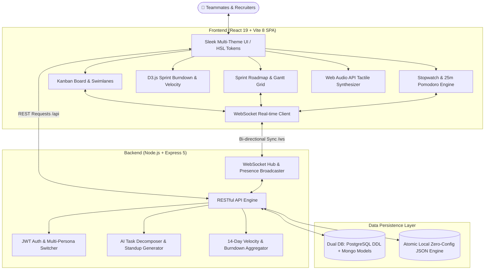

# ⚡ PulseFlow — Enterprise Agile Kanban & Workflow Intelligence Engine

<p align="center">
  
  
  
  
  
  
  
  
</p>

> **PulseFlow** is a next-generation agile project management, workflow intelligence, and real-time collaborative execution platform inspired by Linear, Jira, and Trello. Engineered to streamline cross-functional product delivery with real-time WebSocket synchronization, D3.js burndown trajectories, active task stopwatch and Pomodoro tracking, AI task decomposition, and an executive multi-theme design system.

---

## 📌 About the Project

**PulseFlow** was engineered to bridge the gap between simple, static todo lists and modern enterprise-grade Agile platforms like Linear, Jira, and Asana. Cross-functional engineering teams often struggle with disjointed task tracking, lack of real-time collaborative synchronization, opaque velocity metrics, and repetitive administrative overhead like writing daily standup updates.

PulseFlow solves these core challenges by unifying:
1. **Real-Time Collaborative Execution**: Low-latency bi-directional WebSocket event bus synchronizing card movements, column transitions, and Figma-style live collaborator presence indicators across multiple concurrent browser sessions.
2. **Mathematical Sprint Intelligence**: Custom D3.js v7 sprint burndown trajectories comparing remaining effort against ideal velocity curves, accompanied by Chart.js workload distributions and engineer velocity metrics.
3. **AI-Powered Agile Automation**: Heuristic & LLM-ready task decomposition (auto-generating technical subtasks, story points, and domain tags) and 1-click automated Daily Standup generation (*Yesterday*, *Today*, *Blockers*) derived directly from active timer session logs.
4. **Embedded Precision Time Tracking**: Floating live stopwatch ticker and 25-minute Pomodoro focus sprints with animated soundwave visualizers and zero-dependency Web Audio API sound synthesis.
5. **Enterprise-Grade DevOps & Persistence**: Production multi-stage Docker containerization, indexed PostgreSQL relational DDL with cascading rules, MongoDB models, and an atomic zero-config file database for 30-second local onboarding.

---

## 🏗️ System Architecture



---

## 🌟 Key Features

### 1. 📋 High-Performance Kanban Board & Horizontal Swimlanes
* **5-Stage Enterprise Workflow**: `Backlog` ➔ `To Do (Pending)` ➔ `In Progress (Ongoing)` ➔ `In Review & QA` ➔ `Completed (Done)`.
* **Horizontal Swimlane Mode**: 1-click toggle to organize tasks into horizontal swimlanes **By Assignee** (Team view) or **By Priority** (*Urgent* ➔ *Low*).
* **Native HTML5 Drag & Drop**: Fluid task repositioning with optimistic UI updates and real-time WebSocket broadcasting across active browser tabs.
* **Milestone Confetti**: Canvas-confetti physics explosions trigger when tasks move into the `Completed` column.
* **Dynamic Columns**: Add, customize, and color-code workflow stages on the fly.
* **Inline Quick-Add**: Create backlog cards with `Enter` in <100ms.

### 2. 🤖 AI & Workflow Intelligence Suite
* **AI Task Decomposition Copilot**: In the task inspector, clicking **"AI Decompose"** automatically generates 4 technical subtasks, acceptance criteria, story point estimates, and domain tags based on task context.
* **Automated Daily Standup Generator**: One-click aggregation of the active user's completed deliverables, in-flight work, and active timer logs into standard 3-question agile standup format (*Yesterday*, *Today*, *Blockers*) with 1-click clipboard copy.
* **Cycle Time Risk & Bottleneck Detection**: Automatically detects and highlights tasks with glowing warning badges:
  * `⚠️ Overdue`: Tasks past scheduled deadline.
  * `⚠️ Effort Overrun`: Active tracked hours exceeding initial estimation.

### 3. 📅 Interactive Gantt / Timeline Roadmap View
* **Multi-Day Sprint Gantt Grid**: Visualizes all deliverables across a 14-day sprint cycle.
* **Visual Progress Fill**: Horizontal task span bars show real-time subtask completion % and stage colors.
* **Day 9 Indicator**: Clearly marks the current sprint date with an active cyan guideline.

### 4. 👥 Live Collaborative Presence (Figma-Style)
* **Card-Level Live Viewers**: Shows who is currently inspecting any task card in real-time with glowing avatar badges.
* **Live Active Counter**: Real-time counter badge (`● 3 Online`) with audio cues when collaborators join or move cards.

### 5. ⏱️ Live Task Stopwatch & 25-Min Pomodoro Focus Sprint
* **Floating Global Timer Banner**: Follows active work across views, showing live `hh:mm:ss` elapsed stopwatch tickers with animated soundwaves.
* **Pomodoro Mode**: One-click toggle into a 25-minute focus countdown with completion chimes.
* **Work Session Logging**: Stop sessions to automatically log durations, add work notes, and calculate team efficiency.

### 6. 📊 Executive Analytics & Visualizations (D3.js + Chart.js)
* **Interactive D3.js Sprint Burndown Trajectory**: Renders remaining effort versus ideal velocity lines with animated gradient fills and crosshair inspection.
* **Chart.js Task Distribution**: Multi-slice doughnut chart visualizing workload across columns.
* **Team Velocity & Workload Bar Chart**: Compares estimated effort against hours logged per engineer.
* **KPI Metrics**: Overall completion rate %, active sprint timeline (Day 9 of 14), total hours tracked, and checklist quality index.

### 7. 📄 Executive Reporting & CSV Export Engine
* **Instant CSV Export**: Generates and downloads full board dataset with deliverables, assignees, priorities, logged hours, and tags.
* **Printable Executive Milestone Summary**: Generates clean, printer-friendly / PDF summary with KPI boxes and registry tables.

### 8. 🎨 Dynamic Multi-Theme Engine
Switch between 4 luxury themes from the top navigation bar:
* 🌌 **Midnight Cyber**: Deep obsidian canvas (`#05070f`) with electric violet (`#8b5cf6`) and cyan neon.
* 🌅 **Sunset Aurora**: Warm obsidian canvas (`#0d0a14`) with glowing coral (`#f43f5e`) and amber gold.
* 🌲 **Matrix Emerald**: Cyber-forest canvas (`#030f0a`) with luminous mint emerald (`#10b981`).
* ❄️ **Nordic Frost**: Ultra-clean executive daylight pearl canvas (`#f8fafc`) with royal blue (`#2563eb`).

### 9. 🎭 Multi-Persona Recruiter Demo Switcher
Instantly test roles and permissions with 1 click:
* **Alex Rivera** — *Staff Product Manager*
* **Sarah Chen** — *Lead Full-Stack Architect*
* **Marcus Vance** — *Principal UI/UX Designer*
* **Elena Rostova** — *DevOps & Reliability Engineer*
* **David Kim** — *Senior Frontend Engineer*

---

## 🛠 Tech Stack & Architecture Justification

| Technology | Role | Why Chosen |
| :--- | :--- | :--- |
| **React 19** | Frontend Framework | Latest concurrent rendering features, instant state updates, zero component latency |
| **Vite 8** | Build Tool | Sub-second HMR, optimized tree-shaking, lightweight production bundle |
| **Node.js & Express 5** | Backend REST API | Asynchronous non-blocking I/O, clean middleware architecture, native JSON support |
| **WebSockets (`ws`)** | Real-time Engine | Bi-directional collaborative state broadcasting with automatic reconnect exponential backoff |
| **D3.js v7** | Data Visualization | Precise SVG manipulation and custom math for ideal vs. actual sprint burndown curves |
| **Chart.js v4** | KPI Visualizations | Fast canvas rendering for status doughnuts and engineer velocity bar charts |
| **Vanilla CSS** | Styling System | Custom HSL tokenized design system, dynamic theme engine, zero heavy Tailwind dependencies |
| **Web Audio API** | Tactile Feedback | Synthesizer audio cues on timer, drag-drop, and task completions without external audio files |
| **Docker & Compose** | Containerization | Multi-stage Dockerfile and full PostgreSQL orchestrator for 1-command deployment |

---

## 📁 Repository Structure

```
pulseflow-agile/
├── Dockerfile                  # Multi-stage production build container
├── docker-compose.yml          # Container orchestrator (App + PostgreSQL)
├── .env.example                # Environment variables template
├── LICENSE                     # MIT Open Source License
├── package.json                # Project dependencies and npm scripts
├── vite.config.js              # Vite configuration with proxy rules
├── index.html                  # HTML entry point with modern typography
│
├── server/                     # Backend Node.js / Express Services
│   ├── server.js               # Express server entry point & static dist hosting
│   ├── websocket.js            # WebSocket hub for multi-client real-time sync
│   ├── routes/                 # Modular REST API endpoints
│   │   ├── ai.js               # AI Task Decomposition & Standup synthesis
│   │   ├── analytics.js        # Velocity metrics & D3 burndown aggregators
│   │   ├── auth.js             # JWT authentication & persona switcher
│   │   ├── boards.js           # Boards, columns, and activities management
│   │   ├── tasks.js            # Tasks CRUD, subtasks, drag reorder, comments
│   │   └── timer.js            # Stopwatch sessions and Pomodoro focus logs
│   ├── middleware/             # JWT auth validation & error handlers
│   └── db/                     # Dual Database Architecture
│       ├── database.js         # Zero-config atomic persistent JSON engine
│       ├── schema.sql          # Production PostgreSQL schema (DDL & Indexes)
│       └── mongo-models.js     # Production MongoDB / Mongoose models
│
└── src/                        # Frontend React 19 Application
    ├── main.jsx                # React root mount
    ├── App.jsx                 # View dispatcher & state orchestration
    ├── index.css               # Design tokens, theme palettes, flex layout
    ├── context/                # React Context state providers
    │   ├── AuthContext.jsx     # Current user & persona switching
    │   ├── BoardContext.jsx    # Real-time board state & WebSocket listener
    │   ├── ThemeContext.jsx    # 4-theme palette switcher
    │   └── TimerContext.jsx    # Live stopwatch & Pomodoro state engine
    ├── components/             # Reusable UI components
    │   ├── Navbar.jsx          # Decongested header, view tabs & quick actions
    │   ├── FilterBar.jsx       # 1-line compact search, priority & assignee filter
    │   ├── KanbanColumn.jsx    # Drag-over column with inner scroll containment
    │   ├── TaskCard.jsx        # Compact, breathable scannable card design
    │   ├── BoardView.jsx       # Kanban board & horizontal swimlane views
    │   ├── TimelineView.jsx    # 14-day interactive Gantt roadmap
    │   ├── AnalyticsView.jsx   # D3.js sprint burndown & executive charts
    │   ├── ListView.jsx        # Spreadsheet table view of tasks
    │   ├── TaskModal.jsx       # Inspector: Markdown desc, subtasks, comments, AI
    │   ├── NewTaskModal.jsx    # Task creation modal with priority & estimates
    │   ├── StandupModal.jsx    # AI automated daily standup generator
    │   ├── ActiveTimerBar.jsx  # Floating live stopwatch ticker with soundwaves
    │   └── NotificationToast.jsx # Collaborative WebSocket toast alerts
    └── utils/                  # Utility helpers
        ├── audio.js            # Web Audio API sound synthesizer
        ├── export.js           # CSV generator & printable executive report
        └── helpers.js          # Time formatters, due date badges, cycle times
```

---

## 🚀 Quick Start Guide

### Prerequisites
* **Node.js**: v18.0.0 or higher
* **npm**: v9.0.0 or higher

### Option 1: Run Locally (Fastest)

1. **Clone the repository**:
   ```bash
   git clone https://github.com/abhishek947kumar/pulseflow-agile.git
   cd pulseflow-agile
   ```

2. **Install dependencies**:
   ```bash
   npm install
   ```

3. **Start the development servers**:
   ```bash
   npm run dev
   ```
   * Express API running on: `http://localhost:5000`
   * Vite Frontend running on: `http://localhost:5173`
   * WebSocket live sync on: `ws://localhost:5000/ws`

4. Open your browser at **`http://localhost:5173`**.

---

### Option 2: Docker Compose (Production Environment)

Run the full multi-container stack (App + PostgreSQL) with a single command:

```bash
docker-compose up --build
```

Access the application at **`http://localhost:5000`**.

---

## 📡 REST API Reference

| Method | Endpoint | Description |
| :--- | :--- | :--- |
| `GET` | `/api/health` | Health check & system status |
| `POST` | `/api/ai/decompose` | AI Copilot task breakdown into technical subtasks |
| `POST` | `/api/ai/standup` | Generate automated 3-question agile standup |
| `GET` | `/api/auth/users` | List all team member personas |
| `POST` | `/api/auth/demo-switch` | 1-click persona switch for recruiter testing |
| `POST` | `/api/auth/login` | Email/password JWT login |
| `GET` | `/api/boards` | List boards |
| `GET` | `/api/boards/:id` | Fetch board with columns, tasks, and activities |
| `POST` | `/api/boards/:id/reset` | Reset board to clean showcase demo dataset |
| `POST` | `/api/tasks` | Create new task |
| `POST` | `/api/tasks/:id/move` | Move task to a new column or reorder position |
| `PUT` | `/api/tasks/:id` | Update task details (title, description, priority, etc.) |
| `DELETE` | `/api/tasks/:id` | Delete task |
| `POST` | `/api/tasks/:id/subtasks` | Add checklist subtask item |
| `PATCH` | `/api/tasks/:id/subtasks/:subId` | Toggle checklist item completion |
| `POST` | `/api/tasks/:id/comments` | Post comment to task discussion |
| `POST` | `/api/timer/start` | Start live stopwatch on task |
| `POST` | `/api/timer/stop` | Stop active timer and log elapsed session |
| `GET` | `/api/analytics/:boardId` | Get 14-day D3 burndown data and Chart.js metrics |

---

## 🚢 Publishing to GitHub

To push this repository to your GitHub account:

```bash
# 1. Initialize git
git init

# 2. Stage all files
git add .

# 3. Commit
git commit -m "feat: complete PulseFlow enterprise agile project management platform"

# 4. Set default branch to main
git branch -M main

# 5. Link your remote GitHub repository
git remote add origin https://github.com/<your-github-username>/pulseflow-agile.git

# 6. Push
git push -u origin main
```

---

## 📄 License

This project is licensed under the **MIT License** — see the [LICENSE](LICENSE) file for details.

Developed with ❤️ by **Abhishek Kumar**.
